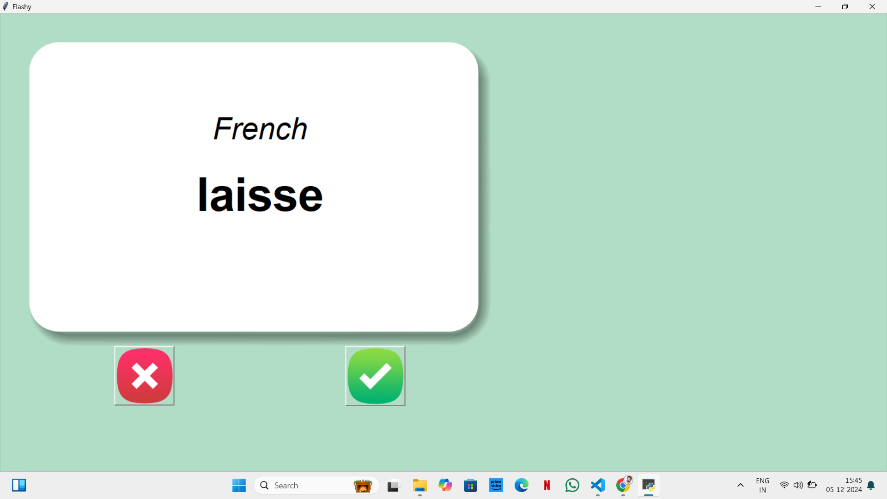
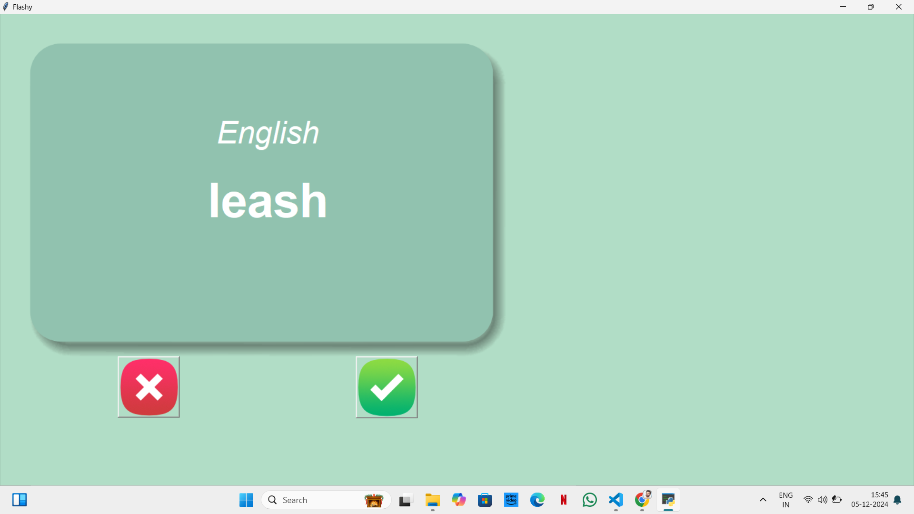
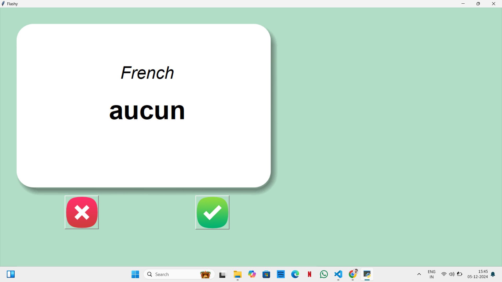
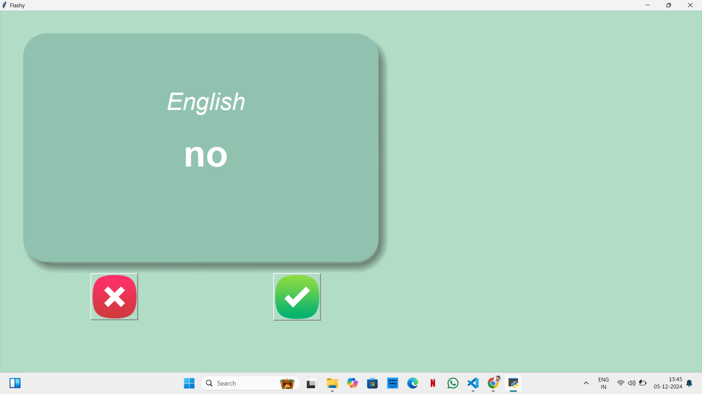

# FlashCardApp

## Overview
It is an interactive language learning application that uses flashcards to help users improve their vocabulary in a fun and engaging way. The app displays French words on one side of a card, and their English translations on the other. Users can mark words they already know, ensuring a personalized learning experience by focusing on unfamiliar words.

---

## Features

- **Flashcards:** Displays a random French word with an option to see its English translation.
- **Progress Tracking:** Removes known words from the learning list.
- **Easy-to-Use Interface:** Built using `tkinter` for a clean and intuitive user experience.
- **Data Saving:** Saves the remaining words to a file so users can continue from where they left off.

---

## How to Use

1. **Start the App:** Run the program to display the first flashcard.
2. **Learn New Words:** 
   - Wait 3 seconds to see the English translation.
   - Click ❌ if you don’t know the word to move on.
   - Click ✅ if you know the word to remove it from the list.
3. **Track Progress:** The app saves your progress automatically in `words_to_learn.csv`.

---

## Requirements

- Python 3
- Libraries: `tkinter`, `pandas`

## Screenshots

  
  
  
  
  

